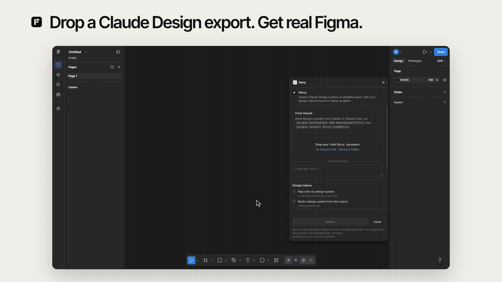

# Ferry

A Figma plugin that imports Claude Design screens as editable layers, with your
design tokens as **Figma variables** (mapped onto your existing ones, or built
from the export) rather than baked in as hex literals, and light/dark themes as
variable modes.



Runs locally inside Figma. No server, no account. It loads only what a design itself uses from the web: its Google Fonts, and Tailwind for designs built with it. Nothing about the design leaves your machine.

> Not affiliated with Anthropic or Figma. "Claude Design" is used only to
> describe what this imports.


## Send straight from Claude (Ferry Link)

Tell Claude "send my Portfolio to Figma" and the design appears in the Ferry panel, ready to import; no zip to download. Set it up once from Claude Code: see [`ferry-link/README.md`](ferry-link/README.md).

## The problem

The workflow today is:

> Export HTML, import through html.to.design, **then clean everything up.**

That last step is the whole cost, and it is two things:

1. **Re-applying the design system.** A generic HTML importer sees
   `background: #1B6F58` and writes `#1B6F58` onto a rectangle. The designer then
   hand-swaps hundreds of literals back to their library styles.
2. **Rebuilding structure.** Absolutely-positioned frames look right and edit
   terribly. Move one thing and nothing reflows.

## Why this can do better

Claude Design projects are not arbitrary HTML. They ship their design system as
CSS custom properties under `_ds/<system>/tokens/*.css`, with a semantic layer
aliasing a primitive ramp:

```css
--acme-green-700: #1B6F58;        /* primitive */
--primary: var(--acme-green-700); /* semantic alias */
```

So token identity is *recoverable*, and a colour can arrive in Figma still
knowing its own name.

### You choose what happens to tokens

Three operations, offered as three radios because they are different jobs and not
three flavours of one setting:

- **Map onto your existing library.** Each incoming token resolves to a variable
  you already have. This is the section below.
- **Build a design system from the export.** The export's own `_ds` becomes a
  real Figma library: the primitive ramp, the semantic layer as genuine aliases
  onto it, and one mode per themed surface. Use it when you have no library yet
  and want the export to give you one.
- **None.** Colours come in as literal values. Honest, and sometimes what you
  want.

#### Map onto your existing library

Every incoming token resolves in this order:

1. an existing variable whose **name** matches, normalised across separator and
   grouping conventions, so `acme-green-700`, `color/acme-green/700` and
   `Acme Green/700` are understood to be the same token;
2. an existing **local** variable holding the identical value;
3. a **newly created** variable, if you allowed that.

Value matching is deliberately local-only. Team-library listings expose a
variable's key, name and type but not its value, so matching a library by value
would mean importing every variable in it just to look.

Anything your library does not cover lands in a clearly-labelled separate local
collection rather than being silently dropped, and aliases are only rewired
between variables the plugin created itself. Repointing one of your existing
library variables at another would be a destructive edit to your design system,
not an import.

Literal values are reverse-matched too, so `#1B6F58` written inline still
resolves to `acme-green-700`. That matters because Claude Design frequently
emits resolved hex even where a token exists.

Numeric matching is **category-aware**: `--space-4: 16px` and `--radius-lg: 16px`
are both `16`, and binding a corner radius to a spacing variable looks right
until someone retunes their spacing scale and every card changes shape. A
measurement only binds within its own family, or stays a literal.

#### Themed surfaces become modes

An export that re-themes itself for light and dark re-declares the same token
names under a theme class (`.theme-light` / `.theme-dark`), or on the page root
(`:root` beside `:root[data-theme="dark"]`, `:root.dark`, or
`@media (prefers-color-scheme: dark)`), which is what Claude Design writes by
default. Either way they become **modes** on the Figma collection, the base mode
named for the theme it implies, and the imported frame starts in whichever theme
the page rendered in. A single bound variable renders correctly in both and the
whole import flips between them from one control. Where a theme cannot get its own mode
(a Free team plan allows one mode per collection), the value stays literal rather
than binding to the other theme's colour and rendering wrong.

When two screens in the same batch disagree on what a token means, the first
screen to declare it owns the variable and the others keep their own value as a
literal, decided per token and per mode. A screen never silently inherits another
screen's colour.

### Structure

- Explicit `display:flex` / `grid` becomes Figma auto-layout: direction, gap,
  padding, wrap and alignment.
- Plain block stacks are **inferred** into auto-layout when children are
  non-overlapping *and* evenly spaced. Even spacing is the signal the gap was
  intentional. When gaps vary the frame stays absolute on purpose, because a
  wrong auto-layout is worse than an honest absolute one: it silently moves
  things the moment you edit a child.
- Sizing is conservative. `FILL` only where the DOM said grow or stretch,
  otherwise `FIXED`, so you get real structure without the import reflowing
  itself on arrival.
- Wrappers around inline text that carry a background, border or padding become
  a padded frame containing a text layer, instead of collapsing to a bare text
  node and losing the box.
- Measurements snap through sub-pixel noise. The browser resolves lengths against
  the device pixel grid, so a declared 12px gap can measure 11.99 and a 3px
  border 2.73; carried through verbatim that noise becomes 11.99 gaps and 2.73
  strokes in your file.

### A project is more than one screen

A Claude Design export is usually several screens, and Ferry imports all of
them in one pass, laid out on a grid with real spacing rather than dropped on top
of each other.

Two cases get their own handling:

- **Declared states.** A screen that ships an enumerated state matrix (an empty
  state, an error state, a loading state) comes in as one frame per state, not a
  single frame frozen in whichever state rendered first.
- **Prototype flows.** Where the export declares a flow across screens or states,
  Ferry wires it as Figma prototype reactions with a flow starting point, so
  the relationship survives the import instead of flattening to a pile of frames.

## Getting a file Ferry can use

The best input is the project's **`.zip` export**: drop it straight onto the
dropzone and Ferry unpacks it, so every screen and the whole `_ds/` arrive
together and tokens resolve. There is no separate unzip step to do first.

If you only have a single `.dc.html`, that file still links
`_ds/<system>/tokens/*.css` you do not have, and without those there is no design
system to map. You are already in a conversation with Claude, so the fix is a
prompt. Ferry detects the missing system, says so, and gives you a **Copy
prompt** button for:

> Make a self-contained copy of this page for export. Inline every stylesheet the
> page links from `_ds/` directly into a `<style>` block in the document, and
> inline any images it references from `assets/` as base64 data URIs. Keep all
> class names, inline styles and CSS custom property names exactly as they are,
> and do not resolve `var()` references to literal values. Save it as a new
> `.html` file.

Download that file, drop it in, and tokens resolve.

Without it the import still works, it just brings colours in as literals.

## Install (development)

```bash
cd figma-plugin
npm install
npm run build
```

Figma: **Plugins → Development → Import plugin from manifest…** and pick
`figma-plugin/manifest.json`.

## Publishing checklist

- [x] `manifest.json` carries the `id` Figma assigned on publish
      (`1686906820698118797`), so plugin updates map to the same listing.
- [x] Community listing assets in `branding/`: 128x128 icon, 1920x1080 cover, a
      20-second import video and four carousel images, all real Figma captures,
      rebuilt from `branding/src/` with `sh branding/render.sh`; title, tagline and
      description in `branding/LISTING.md`.
- [x] Keep the non-affiliation line in the listing as well as in the UI. Carried
      in `branding/LISTING.md`.
- [x] `networkAccess` allows `fonts.googleapis.com` and `fonts.gstatic.com` only, with the reason stated. Measured in a real Figma panel: under `none`, a design's Google Fonts never load, so its text was measured in a fallback face and re-wrapped in Figma.
- [ ] Publish: Figma desktop → Plugins → Development → Ferry → Publish, upload
      the two assets, paste the copy, submit for review. (Manual, one-time.)

## How it is put together

A Figma plugin is two environments that share nothing:

| | environment | can | cannot |
|---|---|---|---|
| `src/ui/` | iframe | measure a real DOM | touch the Figma document |
| `src/plugin/` | sandbox | build Figma nodes | lay out or measure anything |

The UI half renders the document offscreen, measures it, and emits a JSON **IR**
(`src/ir/`); the sandbox half turns that IR into nodes.

The UI renders into its *own* document rather than a nested iframe deliberately:
a `srcdoc` iframe inside a plugin inherits an opaque origin, and two opaque
origins are not same-origin, so `contentDocument` would be unreadable and nothing
could be measured. The cost is that the imported document's global CSS also
applies to the plugin UI, which is why every UI class is namespaced `cd2f-`.

Node creation is synchronous, so the builder yields on a time budget and reports
progress; without that a few thousand nodes freeze the editor with no feedback
and no way out. The whole import commits as a single undo step, and a build that
throws removes its partial tree rather than leaving half a screen on the canvas.

## Animation projects

A Claude Design animation project (a `.dc.html` that declares `window.OM_SCENES` and mounts one component from sibling `.jsx` files) is rendered for real: Ferry bundles React 18.3.1, compiles the JSX with Sucrase, and drives the engine's own `data-om-seek-to-time-frame` event. Each scene becomes a frame, captured at the moment in the scene where the most content is fully on screen. The frames are wired as a prototype that plays itself: each waits out its scene's duration, Smart Animates to the next, and loops when the project loops. Import the whole project `.zip` so the `.jsx` files come along.

## Motion, viewport and what the page paints outside the DOM

- The page is measured at the design's size (1440x900 by default), not the plugin window's: `vw`/`vh` units become px and size media queries are answered for the design.
- Entrance animations and transitions are finished, infinite loops reset to rest, scroll-driven animations cancelled, scroll-reveal observers report everything visible, and the document's own reduced-motion rules apply.
- A document's script runs its timers and animation frames on a virtual clock, so counters and typewriters reach their end; slow intervals (slideshows) do not advance.
- `::before`/`::after` become real layers; rotation, gradient text, z-index order, ellipsis and line-clamp, `object-fit`, blend modes, text-shadow, percentage radii, canvas and video poster frames, SVG images and CSS background images all import.

## Tests

Two suites, because the plugin has two halves that go wrong in different ways.

**The extractor** runs in a real browser DOM, so it is tested in one. A headless
runner drives `test/fixture/harness.html` in Chrome over the DevTools protocol
and reports every assertion by name, with no npm dependencies of its own:

```bash
cd figma-plugin
npx esbuild test/entry.ts --bundle --outfile=test/fixture/bundle.js --target=es2020 --format=iife
node test/e2e/harness-headless.mjs        # 201 checks
```

It covers alias resolution, category-aware numeric matching, flex and inferred
auto-layout, the negative control that uneven stacks stay absolute, mixed inline
text runs, gradients, shadows, per-side borders, sub-pixel snapping, theme-axis
detection, form-control text, overflow clipping, and the missing-`_ds` path
including that no stale tokens leak into it. The fixture's token file is taken
from a real Claude Design `_ds` system.

**The builder** runs inside Figma's sandbox, which is not a place a test can go,
so it is driven through a mock of the Figma API. The end-to-end runner feeds
captured IR (produced by the real extractor) into the real `src/plugin/build.ts`,
points the ambient `figma` global at the mock, and asserts on the node tree it
builds. Nothing in `src/` is stubbed:

```bash
npx esbuild test/e2e/run.ts --bundle --outfile=test/e2e/run.mjs --format=esm --platform=node --target=node18
node test/e2e/run.mjs                      # 138 checks
```

It covers batch layout and spacing, state enumeration, prototype flows, variable
collection creation and reuse, theme modes, and the cross-screen rule that one
screen never binds to another screen's colour.

Set `window.__CD2F_DEBUG = true` to trace extraction. It is a long synchronous
walk over someone else's markup, and when it stalls there is otherwise nothing to
look at.

## Status

Both halves are exercised and the plugin runs inside Figma. The extractor is
covered by 201 browser assertions and the builder by 138 end-to-end assertions
against a mock Figma API, and real Claude Design exports have been imported
through the real code path, including the multi-screen panel system this was
built against.

Two behaviours are assumed rather than verified, because they can only be seen in
a real Figma file, and both default to the safe choice in `src/plugin/build.ts`:
whether a frame nested in a Section can be a flow starting point, and whether
Figma auto-creates a starting point on the first `setReactionsAsync`.

Not yet done:

- Component detection. Repeated identical subtrees should become one component
  with instances.
- A preview of what will bind to what, before committing the import.
- CSS `background-image: url()` is warned about, not imported. 2D grids
  approximate to a wrapping row.
- Text styles. Typography comes across as raw properties rather than bound to
  Figma text styles.
